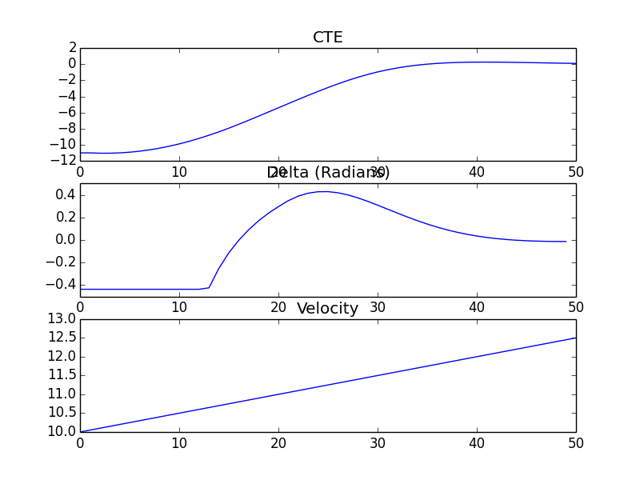

## Global Kinematic Model

```
$ ./global_kinematic_model
0.212132
0.212132
0.798488
     1.3
```

## Polyfit

```
$ ./polyfit
-0.905562
-0.226606
0.447594
1.11706
1.7818
2.44185
3.09723
3.74794
4.39402
5.03548
5.67235
6.30463
6.93236
7.55555
8.17423
8.7884
9.3981
10.0033
10.6041
11.2005
11.7925
```

## MPC to Line

1. Set N and dt.
2. Fit the polynomial to the waypoints.
3. Calculate initial cross track error and orientation error values.
4. Define the components of the cost function (state, actuators, etc).
5. Define the model constraints.



```
$ ./mpc
Iteration 0

******************************************************************************
This program contains Ipopt, a library for large-scale nonlinear optimization.
 Ipopt is released as open source code under the Eclipse Public License (EPL).
         For more information visit http://projects.coin-or.org/Ipopt
******************************************************************************

Cost 23595.2
x = -0.5
y = 10
psi = -0.0817101
v = 10.05
cte = -11
epsi = -0.0817101
delta = -0.436332
a = 1

Iteration 1
Cost 23409.5
x = 0.000823452
y = 9.95899
psi = -0.163829
v = 10.1
cte = -11.041
epsi = -0.163829
delta = -0.436332
a = 1

Iteration 2
Cost 23221.1
x = 0.499062
y = 9.87662
psi = -0.246356
v = 10.15
cte = -11.0414
epsi = -0.246356
delta = -0.436332
a = 1

Iteration 3
Cost 23029.6
x = 0.991239
y = 9.75286
psi = -0.329292
v = 10.2
cte = -11.0004
epsi = -0.329292
delta = -0.436332
a = 1

Iteration 4
Cost 22836.7
x = 1.47384
y = 9.58794
psi = -0.412636
v = 10.25
cte = -10.9178
epsi = -0.412636
delta = -0.436332
a = 1

Iteration 5
Cost 22643.7
x = 1.94332
y = 9.38241
psi = -0.496389
v = 10.3
cte = -10.7935
epsi = -0.496389
delta = -0.436332
a = 1

Iteration 6
Cost 22451.9
x = 2.39617
y = 9.13714
psi = -0.58055
v = 10.35
cte = -10.6277
epsi = -0.58055
delta = -0.436332
a = 1

Iteration 7
Cost 22262.7
x = 2.82888
y = 8.8533
psi = -0.66512
v = 10.4
cte = -10.421
epsi = -0.66512
delta = -0.436332
a = 1

Iteration 8
Cost 22077.1
x = 3.23804
y = 8.53238
psi = -0.750099
v = 10.45
cte = -10.1742
epsi = -0.750099
delta = -0.436332
a = 1

Iteration 9
Cost 21895.9
x = 3.62031
y = 8.17619
psi = -0.835486
v = 10.5
cte = -9.88857
epsi = -0.835486
delta = -0.436332
a = 1

Iteration 10
Cost 21719.9
x = 3.97249
y = 7.78683
psi = -0.921282
v = 10.55
cte = -9.56554
epsi = -0.921282
delta = -0.436332
a = 1

Iteration 11
Cost 21549.5
x = 4.29152
y = 7.36675
psi = -1.00749
v = 10.6
cte = -9.20692
epsi = -1.00749
delta = -0.436332
a = 1

Iteration 12
Cost 21385.4
x = 4.57453
y = 6.91864
psi = -1.0941
v = 10.65
cte = -8.81486
epsi = -1.0941
delta = -0.436332
a = 1

Iteration 13
Cost 21227.9
x = 4.81887
y = 6.4455
psi = -1.17856
v = 10.7
cte = -8.39177
epsi = -1.17856
delta = -0.423522
a = 1

Iteration 14
Cost 21076.7
x = 5.02337
y = 5.95113
psi = -1.22888
v = 10.75
cte = -7.93987
epsi = -1.22888
delta = -0.25111
a = 1

Iteration 15
Cost 20933
x = 5.20359
y = 5.44474
psi = -1.25176
v = 10.8
cte = -7.45752
epsi = -1.25176
delta = -0.113664
a = 1

Iteration 16
Cost 20796.7
x = 5.37296
y = 4.93199
psi = -1.25229
v = 10.85
cte = -6.95749
epsi = -1.25229
delta = -0.002591
a = 1

Iteration 17
Cost 20668
x = 5.54285
y = 4.41678
psi = -1.23388
v = 10.9
cte = -6.44721
epsi = -1.23388
delta = 0.0905932
a = 1

Iteration 18
Cost 20546.6
x = 5.72301
y = 3.90242
psi = -1.1992
v = 10.95
cte = -5.93114
epsi = -1.1992
delta = 0.169891
a = 1

Iteration 19
Cost 20432.2
x = 5.92181
y = 3.39229
psi = -1.1505
v = 11
cte = -5.41255
epsi = -1.1505
delta = 0.237484
a = 1

Iteration 20
Cost 20324.5
x = 6.14623
y = 2.89015
psi = -1.08965
v = 11.05
cte = -4.89442
epsi = -1.08965
delta = 0.295423
a = 1

Iteration 21
Cost 20222.8
x = 6.40192
y = 2.40038
psi = -1.01756
v = 11.1
cte = -4.37992
epsi = -1.01756
delta = 0.348362
a = 1

Iteration 22
Cost 20126.7
x = 6.69354
y = 1.92817
psi = -0.936826
v = 11.15
cte = -3.87259
epsi = -0.936826
delta = 0.388409
a = 1

Iteration 23
Cost 20035.7
x = 7.02378
y = 1.479
psi = -0.850255
v = 11.2
cte = -3.37734
epsi = -0.850255
delta = 0.41461
a = 1

Iteration 24
Cost 19949.1
x = 7.39326
y = 1.05819
psi = -0.760592
v = 11.25
cte = -2.89981
epsi = -0.760592
delta = 0.4275
a = 1

Iteration 25
Cost 19866.3
x = 7.80075
y = 0.670432
psi = -0.670391
v = 11.3
cte = -2.44595
epsi = -0.670391
delta = 0.428152
a = 1

Iteration 26
Cost 19786.8
x = 8.24347
y = 0.319402
psi = -0.581919
v = 11.35
cte = -2.02146
epsi = -0.581919
delta = 0.41809
a = 1

Iteration 27
Cost 19710
x = 8.71757
y = 0.00748749
psi = -0.497082
v = 11.4
cte = -1.63132
epsi = -0.497082
delta = 0.399147
a = 1

Iteration 28
Cost 19635.4
x = 9.21859
y = -0.264324
psi = -0.417387
v = 11.45
cte = -1.2793
epsi = -0.417387
delta = 0.373306
a = 1

Iteration 29
Cost 19562.4
x = 9.74194
y = -0.4964
psi = -0.343939
v = 11.5
cte = -0.967752
epsi = -0.343939
delta = 0.342543
a = 1

Iteration 30
Cost 19490.6
x = 10.2833
y = -0.690289
psi = -0.277458
v = 11.55
cte = -0.697489
epsi = -0.277458
delta = 0.308706
a = 1

Iteration 31
Cost 19419.8
x = 10.8387
y = -0.848473
psi = -0.218317
v = 11.6
cte = -0.467895
epsi = -0.218317
delta = 0.273429
a = 1

Iteration 32
Cost 19349.5
x = 11.4049
y = -0.974094
psi = -0.166598
v = 11.65
cte = -0.277147
epsi = -0.166598
delta = 0.238085
a = 1

Iteration 33
Cost 19279.8
x = 11.9793
y = -1.07069
psi = -0.122143
v = 11.7
cte = -0.122502
epsi = -0.122143
delta = 0.203771
a = 1

Iteration 34
Cost 19210.3
x = 12.56
y = -1.14196
psi = -0.0846079
v = 11.75
cte = -0.000587067
epsi = -0.0846079
delta = 0.171313
a = 1

Iteration 35
Cost 19141
x = 13.1454
y = -1.19161
psi = -0.0535182
v = 11.8
cte = 0.0923169
epsi = -0.0535182
delta = 0.141293
a = 1

Iteration 36
Cost 19071.9
x = 13.7345
y = -1.22317
psi = -0.0283094
v = 11.85
cte = 0.160052
epsi = -0.0283094
delta = 0.114081
a = 1

Iteration 37
Cost 19002.9
x = 14.3268
y = -1.23994
psi = -0.00836651
v = 11.9
cte = 0.206402
epsi = -0.00836651
delta = 0.0898691
a = 1

Iteration 38
Cost 18934.1
x = 14.9218
y = -1.24492
psi = 0.00694485
v = 11.95
cte = 0.234966
epsi = 0.00694485
delta = 0.0687081
a = 1

Iteration 39
Cost 18865.3
x = 15.5193
y = -1.24077
psi = 0.0182544
v = 12
cte = 0.249072
epsi = 0.0182544
delta = 0.0505382
a = 1

Iteration 40
Cost 18796.7
x = 16.1192
y = -1.22982
psi = 0.0261685
v = 12.05
cte = 0.251725
epsi = 0.0261685
delta = 0.0352179
a = 1

Iteration 41
Cost 18728.2
x = 16.7215
y = -1.21406
psi = 0.0312567
v = 12.1
cte = 0.245586
epsi = 0.0312567
delta = 0.0225483
a = 1

Iteration 42
Cost 18659.8
x = 17.3262
y = -1.19515
psi = 0.0340423
v = 12.15
cte = 0.232963
epsi = 0.0340423
delta = 0.0122934
a = 1

Iteration 43
Cost 18591.6
x = 17.9333
y = -1.17447
psi = 0.034997
v = 12.2
cte = 0.215826
epsi = 0.034997
delta = 0.00419621
a = 1

Iteration 44
Cost 18523.4
x = 18.5429
y = -1.15313
psi = 0.0345383
v = 12.25
cte = 0.195816
epsi = 0.0345383
delta = -0.00200786
a = 1

Iteration 45
Cost 18455.5
x = 19.1551
y = -1.13198
psi = 0.0330287
v = 12.3
cte = 0.174279
epsi = 0.0330287
delta = -0.00658074
a = 1

Iteration 46
Cost 18387.6
x = 19.7697
y = -1.11167
psi = 0.0307774
v = 12.35
cte = 0.152287
epsi = 0.0307774
delta = -0.00977401
a = 1

Iteration 47
Cost 18319.9
x = 20.3869
y = -1.09267
psi = 0.028043
v = 12.4
cte = 0.130671
epsi = 0.028043
delta = -0.0118233
a = 1

Iteration 48
Cost 18252.3
x = 21.0067
y = -1.07528
psi = 0.0250371
v = 12.45
cte = 0.110051
epsi = 0.0250371
delta = -0.0129445
a = 1

Iteration 49
Cost 18184.8
x = 21.629
y = -1.0597
psi = 0.021929
v = 12.5
cte = 0.0908665
epsi = 0.021929
delta = -0.0133314
a = 1
```
